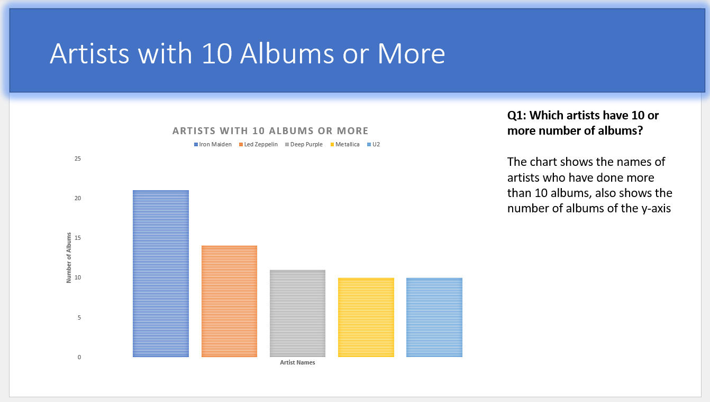

# PortfolioProjects-Analytics

### Chocolate Sales Report

### Bike Sales Dashboard

### Data Exploration, Profit&Loss, and Forecasting of NYSE

New York Stock Exchange data set is downloaded from the internet and data analysis is done using Excel
Profit and Loss Statement Values are Visualized when a company is chosen
Data is Forecasted using Profit and Loss Statement Values and differnt case scenarios like worst, base and best.

### Data Exploration and Visualization in Excel of Chinbook Music

Chinbook Music data set is downloaded from the internet and exploratory data analysis is done using SQL. The results were then exported to excel and visualisations have been created.

### Data Cleaning of Nashville Housing Data Set

Nashville housing data set is downloaded from the internet and the data is cleaned for analysis using SQL.

### Data Exploration of Covid19 Deaths

Covid19 deaths data set is downloaded from the internet and exploratory data analysis is done using SQL.
